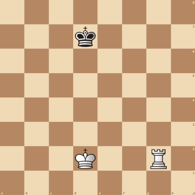
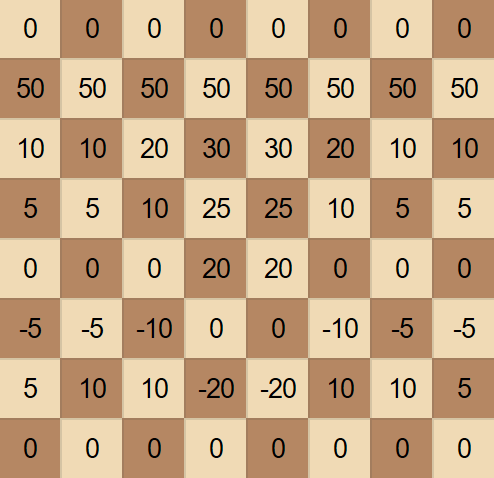
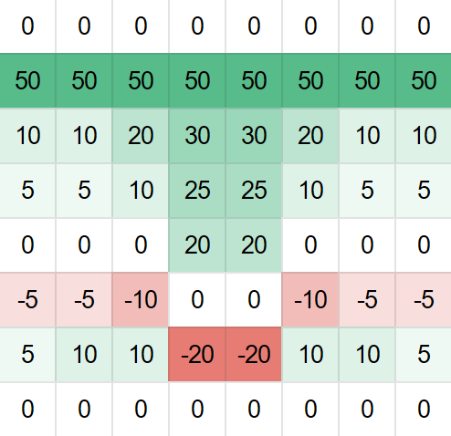

# chess_bot
An in development chess bot which I plan to use on lichess.org

## Table of Contents
* [Setup](#setup)
* [How it works](#how-it-works)

## Setup
As the projects consists of four subprojects there will be different setup guides depending on the purpose of usage.

### Chess Bot
* Navigate to solution file of the chess_engine (https://github.com/jamadaha/chess_bot/tree/master/chess_engine)
* Compile - The program is made for linux and will *proberly* only work on it
* Move the *.out* file to the same folder as the server file 
* Turn on server with node. See (https://github.com/jamadaha/chess_bot/tree/master/chess_server)

### Chess Bot Tests
These are standard unit test for a Visual Studio solution. Opening the chess_engine solution (https://github.com/jamadaha/chess_bot/tree/master/chess_engine) will display them automatically.

### Data Cleaning
Not working atm. 

## How it works
### Chess engine
There are three primary parts to how this chess engine works: move generation, board evaluation and Minimax. These parts work together to generate a move given PGN input (or other input types).
#### Move generation
This works by going through all pieces for the side whose turn it is, where all pieces gone through is checked for valid moves. A valid move is any move which is legal in a game of chess. The moves are generated by looking through all squares which should be possible given a blank board, except when encountering obstacles i.e. pieces in the line of movement. As an example, when generating the moves for a rook each file is checked starting from the position of the piece, stopping only on encountering either a friendly piece or an enemy piece, where the latter is counted as a move aswell. 

The moves are calculated in a relativly naive manner, as all moves are recalculate every time. 

#### Board evaluation
When evaluating the board two parts are calculated: piece values and positional values.
The piece values are pretty straight forward; all pieces are given a fixed value and as long as they are still alive, their value is counted.
The more complicated part is the position value. This value is calculated by looking at each piece at comparing it to a predefined table of values. An example of this kind of table can be seen below.

Pawn position eval           |  Gradient of pawn position eval
:---------------------------:|:-------------------------:
  |  

The displayed table is the evaluation for pawns where the friendly side is down, i.e. the side currently being calculated is down. If the side which currently being calculated is white, as in minimax was called to generate a move for white, the side down would be white. This is then done for all pieces and summed up to generate a total score for white. The same is then done for black, where the table is reversed for them, i.e. the table is from the viewpoint of the side. These two values are then compared to generate the final value. The equation for this, when calculating for white, looks like *white score - black score = final score*, where the inverse is the score for black.

For the purpose of optimization, when calculating the evaluation for a given position the score is stored in a hashmap. The hashmap's hash is a simple implementation of the Zobrist Hashing seen in (https://github.com/jamadaha/chess_bot/blob/master/chess_engine/Classes/zobrist.cpp). When a score is then needed for a given position, which also exists in the hashmap, the score is taken from the hashmap instead of calculating it anew.

#### Minimax
I will not go into too many details of how this works, as I have not deviated far from standard implementation of this algorithm. One thing to note is that the Minimax implementation used, also implements Alpha-beta pruning.
As it stands the algorithm searches a fixed depth i.e. how many layers in a search tree, therefore, the time taken to generate increases with the complexity of the position. This can be a problem as the complexity can increase *very* quickly. A part of the reason behind this, is that the implementation of the algorithm tries to handle the horizon effect (https://en.wikipedia.org/wiki/Horizon_effect). The horizon effect is handled by continued searching into further depths, when the last move searched is a capture i.e. one piece capturing another.
